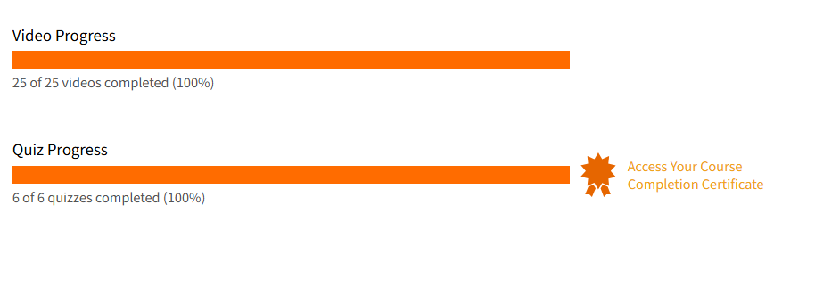

# 🔐 Introduction to Cryptography – Wolfram U

This repository contains summarized theory, demo notebooks, and a certificate of completion for the **"Introduction to Cryptography"** course offered by [Wolfram U](https://www.wolfram.com/wolfram-u/).

---

## 📚 Theory Notes

All theory files are written in Markdown and organized by topic:

- 📂 [`cryptography-overview.md`](./theory/cryptography-overview.md)
- 📂 [`digital-signature-explained.md`](./theory/digital-signature-explained.md)

---

## 🧪 Wolfram Notebook Demos

- 📒 [`CaesarCipher.nb`](./demo/CaesarCipher.nb) – Basic Caesar cipher
- 📒 [`RSAEncryption.nb`](./demo/RSAEncryption.nb) – RSA keygen + encryption
- 📒 [`HashingExamples.nb`](./demo/HashingExamples.nb) – SHA256 and MD5 demo
- 📒 [`SignatureVerification.nb`](./demo/SignatureVerification.nb) – Digital signature verification
- 📒 [`DiffieHellman.nb`](./demo/DiffieHellman.nb) – Key exchange simulation

> 📌 All `.nb` notebooks are executable in **Wolfram Mathematica** or **Wolfram Cloud**.

---

## 📸 Screenshots

| Progress Snapshot              | Screenshot |
|--------------------------------|------------|
| 📺 Video Lesson Progress 1     |  |
| 📺 Video Lesson Progress 2     |  |
| 🧠 Quiz Completion Result      |  |

---

### 📜 Certificate

🧠 [`Introduction-to-Cryptography-WolframU-Certificate.pdf`](./Introduction-to-Cryptography-WolframU-Certificate.pdf)

---

## 📝 Course Review: Wolfram U – Cryptography

The "Introduction to Cryptography" course from Wolfram U provides a structured and hands-on overview of essential cryptographic concepts using **Wolfram Language notebooks**.

✅ What I Liked

- Strong mathematical intuition with step-by-step visual examples  
- Great for people with interest in both **theory** and **practical modeling**
- Executable demos help reinforce concepts interactively
- Excellent integration with real cryptographic operations (RSA, Hashing, Signing)

📌 What Could Be Improved

- Could include more attack examples (e.g., padding oracle, side-channel)
- More real-world context around implementation risks

---

## 🎓 Final Thoughts

This is a solid course for anyone looking to:

- Understand the **mathematics behind cryptography**
- Get hands-on with Wolfram Language
- Bridge theory and demo in a **self-paced** manner

💡 Recommended for: Computer science students, cryptography beginners, or Mathematica users exploring applied security.

---

## 📌 Notes

- All notebooks were created and tested in **Wolfram Mathematica Desktop**  
- Course provider: [Wolfram U](https://www.wolfram.com/wolfram-u/)
- Tools used: Wolfram Language, modular arithmetic, asymmetric encryption, hashing

---

## ✍️ Author

**Thành Danh** – Pentester & Cybersecurity Researcher  

GitHub: [@ngvtdanhh](https://github.com/ngvtdanhh)  
Email: ngvu.thdanh@gmail.com

---

## 📄 License

This project is licensed under the terms of the **MIT License**.  
See [`LICENSE`](./LICENSE) for full details.

© 2025 ngvtdanhh. All rights reserved.
